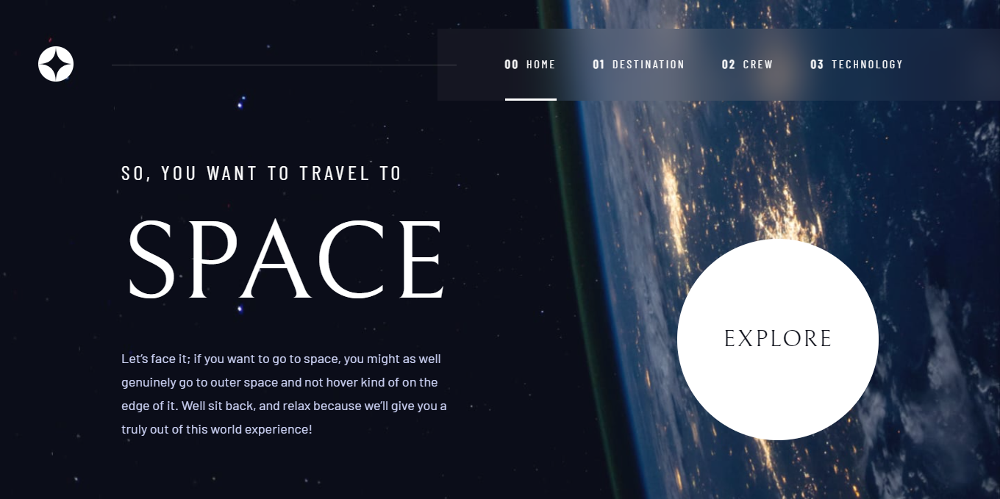

# Frontend Mentor - Space tourism website solution

This is a solution to the [Space tourism website challenge on Frontend Mentor](https://www.frontendmentor.io/challenges/space-tourism-multipage-website-gRWj1URZ3). Frontend Mentor challenges help you improve your coding skills by building realistic projects. 

## Table of contents

- [Overview](#overview)
  - [The challenge](#the-challenge)
  - [Screenshot](#screenshot)
  - [Links](#links)
- [My process](#my-process)
  - [Built with](#built-with)
- [Author](#author)
- [Acknowledgments](#acknowledgments)

## Overview

### The challenge

Users should be able to:

- View the optimal layout for each of the website's pages depending on their device's screen size
- See hover states for all interactive elements on the page
- View each page and be able to toggle between the tabs to see new information

### Screenshot

### Links

- [Solution URL:](https://www.frontendmentor.io/solutions/space-tourism-multi-page-website-sPbeyx6LXz)
- [Live site URL:](https://themidfire.github.io/Space-tourism/)

## My process

### Built with

- Semantic HTML5 markup
- CSS3
[SASS/SCSS](https://sass-lang.com/) - CSS Preprocessor
- Flexbox
- CSS Grid
- [React](https://reactjs.org/) - JS library
- [Vite](https://vitejs.dev/) - Local development server

## Author

- Website - [Mohamed](https://themidfire.github.io/My-Portfolio/)
- Frontend Mentor - [THEMIDFIRE](https://www.frontendmentor.io/profile/THEMIDFIRE)
- Twitter - [THEMIDFIRE](https://x.com/THEMIDFIRE)

## Acknowledgments

Scrimba, Kevin Powell
